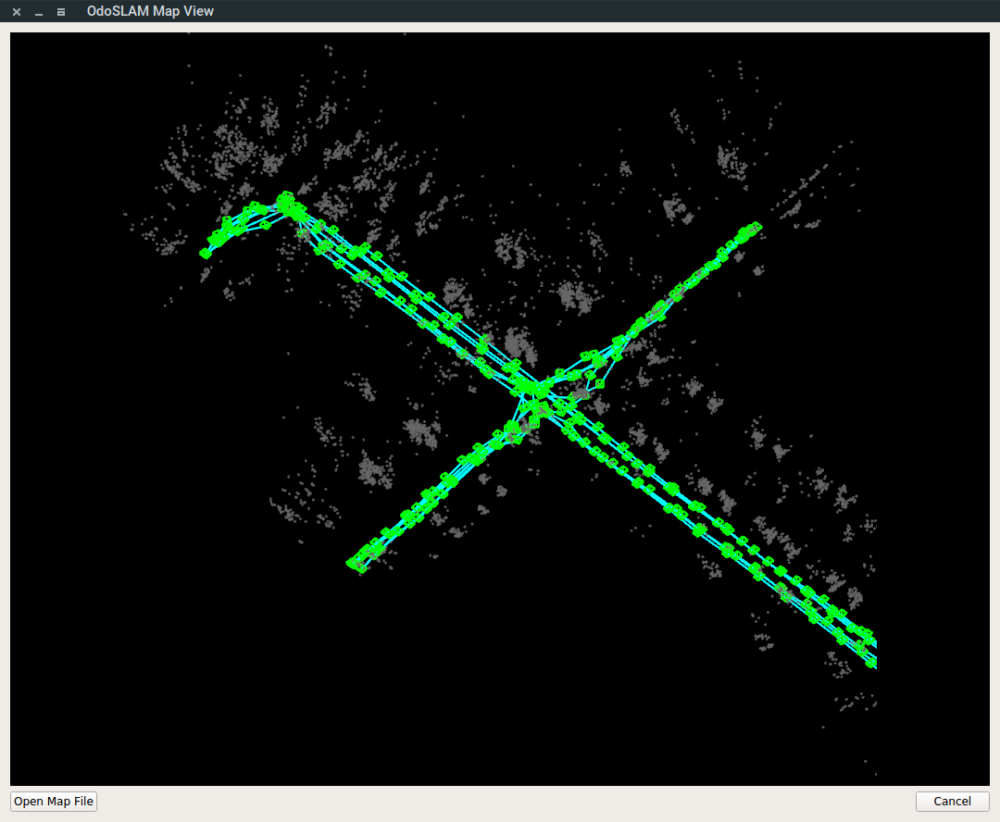

# MapViewer

## MapViewer dependencies :

1. C++ 11 

2. Qt 5.x

3. OpenCV 2.4.x 

4. Qt Creator 

Adjust the INCLUDEPATH and LIBS options in `MapViewer.pro` according to the installation location of OpenCV in your machine.

Note: tested under Windows (Qt 5.7 for MSVC 2015, with OpenCV 2.4.9) and Ubuntu 16.04 (Qt 5.7, with OpenCV 3.2.0 packaged alongside ROS Kinetic).

## MapViewer usage:

1. open executable file MapViewer

2. click on 'Open Map File' button.

3. choose sample map file 'odoslam.map' to open and view the map.

4. scroll the mouse wheel to zoom; drag with left mouse button to rotate; drag with right mouse button to translate.

by fzheng@link.cuhk.edu.hk

## MapViewer work plan

1. add online map viewing function

2. add interface (more buttons) for more functions
